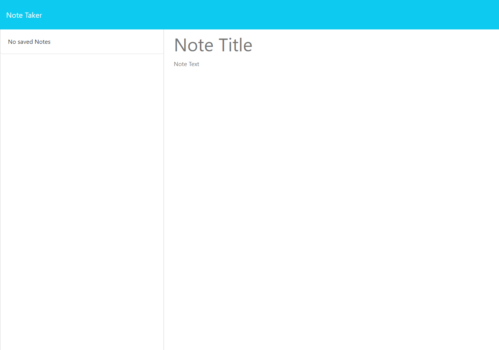

# Note-Tracker

## Description
This note tracking application allows for users to write down titles to their notes with the body text of their choice. The intentions that went into the creation of this application were to allow users to either create a list of items, ideas, or even just a list of names! Through this process I have learned how to properly use app.get, app.post, and app.delete in a server.js in order to allow users to get the informoration from the data, add their own information, and also for them to delete data of their choice.
## Usage

## Deployment link
[Heroku](https://guarded-scrubland-98500-8a9de5484cb0.herokuapp.com/notes)